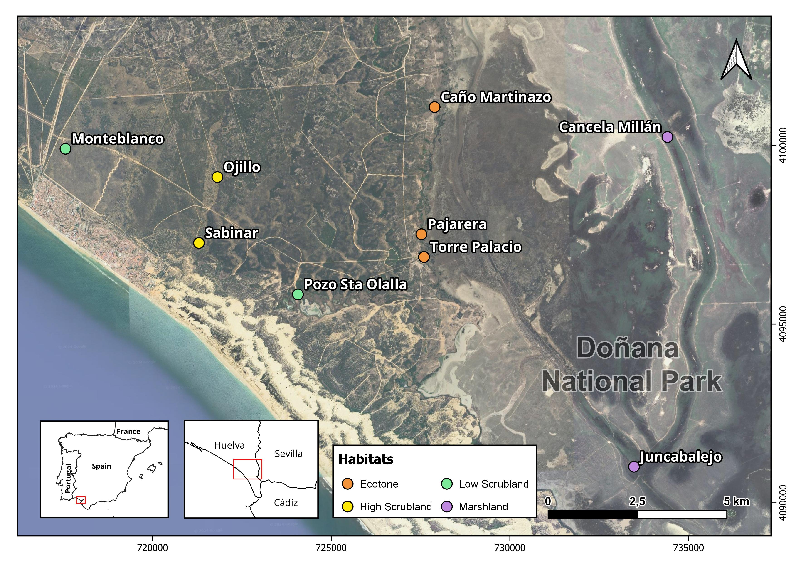

# BIRDeep Bird Song Detector by Neural Networks

[](https://doi.org/10.5281/zenodo.14940480)

## Overview

Passive acoustic monitoring (PAM) is an essential tool for biodiversity conservation, but it generates vast amounts of audio data that are challenging to analyze. This project aims to automate and improve bird species identification.

The **BIRDeep Bird Song Detector** is part of the BIRDeep project, aimed at monitoring bird communities with PAM through deep learning in Doñana National Park.

This repository contains the code, data links, and project resources associated with the research paper:

> Márquez-Rodríguez, Alba, Mohedano-Munoz, M. Á., Marín-Jiménez, M. J., Santamaría-García, E., Bastianelli, G., Jordano, P., & Mendoza, I.  
> **A Bird Song Detector for improving bird identification through Deep Learning: a case study from Doñana**  
> Ecological Informatics, 2025, 103254. https://doi.org/10.1016/j.ecoinf.2025.103254

In the paper [*A Bird Song Detector for improving bird identification through Deep Learning: a case study from Doñana*](https://arxiv.org/abs/2503.15576), we propose a deep learning pipeline for automated bird song detection and species classification using audio recordings from Doñana National Park (SW Spain). The pipeline combines a **YOLOv8-based detector** with a **fine-tuned version of BirdNET**, significantly improving identification accuracy in Doñana soundscapes. The following figure illustrates the pipeline proposed in our study:


**Figure**: Pipeline used for the development of our Bird Song Detector. The process was divided into three main stages:

1. **Preprocess**: AudioMoth recorders were deployed in Doñana to collect audio data as part of the BIRDeep project. Recordings were annotated by experts and split into training, validation, and test sets.

2. **Bird Song Detector**: A YOLOv8-based model was trained to detect segments containing bird vocalizations (presence/absence). It was applied to the test set to extract segments with potential bird vocalizations.

3. **Classifier**: BirdNET was fine-tuned on expert-labeled data from Doñana. Its embeddings were used to train additional ML algorithms. These were validated and tested on the detected segments, resulting in improved species classification (higher True Positives, fewer False Negatives).

### Citation

If you use this repository, please cite the preprint:

```bibtex
@article{marquez2025bird,
  title={A Bird Song Detector for improving bird identification through Deep Learning: a case study from Doñana},
  author={Márquez-Rodríguez, Alba and Mohedano-Munoz, Miguel Ángel and Marín-Jiménez, Manuel J. and Santamaría-García, Eduardo and Bastianelli, Giulia and Jordano, Pedro and Mendoza, Irene},
  journal={Ecological Informatics},
  volume={90},
  pages={103254},
  year={2025},
  publisher={Elsevier},
  doi={10.1016/j.ecoinf.2025.103254}
}
```
📄 [Read the article](https://doi.org/10.1016/j.ecoinf.2025.103254)

### Dataset

The dataset used in this research is publicly available via Hugging Face:

🔗 [BIRDeep_AudioAnnotations on Hugging Face](https://huggingface.co/datasets/GrunCrow/BIRDeep_AudioAnnotations)

Read more in the [Data](#data) section below.

## Table of Contents

- [Overview](#overview)
- [Repository Structure](#repository-structure)
- [Data](#data)
- [Models](#models)
- [Results](#results)
- [Usage](#usage)
- [License](#license)

## Repository Structure

The repository is organized as follows:

- `Bird Classifiers/`: Contains the codes and outputs of the bird classifiers used in the project. It includes BirdNET classifier, embeddings for machine learning based classifiers and other deep learning architectures.
  - `BirdNET/`: Contains BirdNET generated models, training plots and predictions by some of the different models tested.
  - `models/`: Contains the final classifiers used in the project.
  - `Scripts/`: Scripts used for data generation and training of the classifiers. Evaluation scripts are all together in general `Scripts/` folder.
- `BIRDeep Song Detector/`: This directory contains the core structure and files for the Bird Song Detector. Contains the trainings and pre-trained and fine-tuned models data of the Bird Song Detector.
  - `runs/detect/`: Output files, including model predictions and performance metricsfrom the Bird Song Detector.
- `Data/`: Contains the audio data and annotations used for training and evaluation, you can check the [BIRDeep_AudioAnnotations Dataset](https://huggingface.co/datasets/GrunCrow/BIRDeep_AudioAnnotations). Also generated images for Bird Song Detector and Deep Learning Classifiers.
- `Research/`: Information collected during literature review, only a base research README missing a lot of information, for more, please, go to manuscripts.
- `Scripts/`: Jupyter notebooks for data preprocessing and exploratory data analysis.
- `README.md`: This file.

## Data

### Audio Recordings

Data was collected using automatic audio recording devices (AudioMoths) in three different habitats in Doñana National Park. Approximately 500 minutes of audio data were recorded. There are 9 recorders in 3 different habitats (marshland, scrubland, and ecotone), which are constantly running, recording 1 minute and leaving 9 minutes between recordings. That is, 1 minute is recorded for every 10 minutes, with a sampling rate of 32 kHz. The recordings were made prioritising those times when the birds are most active in order to try to have as many audio recordings of songs as possible, specifically a few hours before dawn until midday. Locations of the recorders are shown in the following map:



### Annotations

Expert annotators labeled 461 minutes of audio data, identifying bird vocalizations and other relevant sounds. Annotations are provided in a standard format with start time, end time, and frequency range for each bird vocalization.

🔗 Check the dataset [BIRDeep_AudioAnnotations on Hugging Face](https://huggingface.co/datasets/GrunCrow/BIRDeep_AudioAnnotations)


## Theory

The theory behind this methodology is that Deep Learning models can learn to identify and classify bird species from Mel spectrograms, which are graphical representations of audio data. Just as a general model can achieve good results when Transfer Learning is performed to adapt it to a specific problem.

<!-- The audio data was transformed into Mel spectrograms, which were then used to train a Deep Learning model. First, a detector was developed to find time windows in which a bird song is detected. Then, BirdNET was trained to create a classifier adapted to the ecological context of Doñana. The final objective is to use a pipeline in which the detector obtains the time windows in which there is a bird song and BirdNET, with fine-tuning, performs the classification of the species present. -->

According to the original BirdNET paper: "In summary, BirdNET achieved a mean average precision of 0.791 for single-species recordings, a F0.5 score of 0.414 for annotated soundscapes, and an average correlation of 0.251 with hotspot observation across 121 species and 4 years of audio data." That is, on audios that belong to the domain to which BirdNET belongs, in a real context in which the audios contain soundscapes, that is, soundscapes, the performance is not the best. On the other hand "The most common sources of false-positive detections were other vocalizing animals (e.g., insects, anurans, mammals), geophysical noise (e.g., wind, rain, thunder), human vocal and non-vocal sounds (e.g., whistling, footsteps, speech), anthropogenic sounds typically encountered in urban areas (e.g., cars, airplanes, si rens), and electronic recorder noise. The Google AudioSet is one of the largest collections of human-labeled sounds that span a wide range of classes that are organized in an ontology (Gemmeke et al., 2017). BirdNET can produce many false positives, creating a bird song detector step beforehand can reduce the number of false positives. Following an idea from DeepFaune, in which a first step based on Megadetector is established for photo-trapping cameras to eliminate empty images from those containing animals and thus be able to subsequently apply a classifier only on those samples that are True Positive, reducing the number of False Positives in the classifier.

## Models

### Bird Song Detector

- Based on **YOLOv8**
- Trained on spectrograms annotated with vocalizations
- Achieved a test mAP50 of **~0.30** using full-frequency bounding boxes and a reduced ESC-50 dataset
- Confidence threshold optimized at **0.15** for our study case

### Bird Species Classifier

- Custom Classifier **BirdNET v2.4** with Doñana-specific data
- Extracted embeddings (1024-dim) for training other models
- Classifiers trained: Basic Neural Network, Random Forest, ResNet50, MobileNetV2

### Results

The most significant results are that it seems that there was not enough data available to generate a robust detection model. Future work is needed to improve the detector, since after carrying out various experiments, achieving improvements has been difficult. The greatest improvement achieved has been by moving from temporal and frequency detections to only temporal detections, including the entire frequency spectrum for training and waiting for the entire frequency spectrum for detections.

In addition to finding difficulties with empty instances, i.e. True Negatives and False Positives, Data Augmentation techniques have been included to reduce this. First, background audios were edited for training, modifying intensity and adding noise. This improved, but not significantly. Later, audios from the ESC-50 library were included, which contains focal sounds, eliminating the sounds of birds such as crows and chickens. After applying the training, first results were obtained in which the network did not learn and ended up classifying all instances as empty due to the disproportion of ESC-50 audios compared to the dataset of interest. The number of ESC-50 audios was reduced to find a balance and thus the results were improved, although not very significantly.

The best detector model achieves a mAP50 of 0.29756 in the train, in validation it was around X.XX (to be completed) and in test it was similar to the validation.

Performance when applying the only classifier vs the Bird Song Detector + Classifier pipeline are the following:

| **Classifier**               | **Bird Song Detector** | **Acc.** | **Macro Prec.** | **Macro Rec.** | **Macro F1** | **Weighted Prec.** | **Weighted Rec.** | **Weighted F1** | **Idx Pred/Ann** |
|-----------------------------|------------------------|----------|------------------|----------------|--------------|---------------------|--------------------|------------------|------------------|
| *BirdNET fine-tuned*        | ❌                     | 0.21     | 0.12             | 0.14           | 0.11         | 0.18                | 0.21               | 0.17             | 1.8046           |
| **_BirdNET fine-tuned_**    | ✅                     | 0.30     | 0.21             | 0.14           | 0.13         | 0.37                | 0.30               | 0.28             | 0.9183           |
| *Random Forest*             | ❌                     | 0.19     | 0.10             | 0.10           | 0.08         | 0.19                | 0.19               | 0.15             | 0.9059           |
| **_Random Forest_**         | ✅                     | 0.29     | 0.11             | 0.12           | 0.10         | 0.24                | 0.29               | 0.23             | 0.5435           |
| *ResNet50*                  | ❌                     | 0.02     | 0.00             | 0.03           | 0.00         | 0.00                | 0.02               | 0.00             | 3.2682           |
| **_ResNet50_**              | ✅                     | 0.08     | 0.01             | 0.05           | 0.01         | 0.01                | 0.08               | 0.02             | 0.6306           |
| *MobileNetV2*               | ❌                     | 0.02     | 0.01             | 0.04           | 0.01         | 0.01                | 0.02               | 0.01             | 3.2682           |
| **_MobileNetV2_**           | ✅                     | 0.08     | 0.01             | 0.04           | 0.01         | 0.02                | 0.08               | 0.02             | 0.6306           |

**Note**: All metrics are better at higher values, except for *Idx Pred/Ann*, which is optimal when closer to 1. Bold rows indicate performance improvement when using the Bird Song Detector.

✅ Using the Bird Song Detector improves classification across all models.

<!-- ### Discussion

The results underscore the importance of tailoring deep learning models to specific ecological contexts for accurate species identification. This study demonstrates that general models such as BirdNET can be significantly improved by specific tuning with contextual data.

Compared to previous studies using BirdNET, this research shows an improvement in species detection and classification in a specific ecological context by incorporating a preliminary detector and fine-tuning the model.

Limitations include the relatively small size of the dataset and potential performance improvement with larger and more diverse data. The ability of the model to generalize to other ecological contexts also requires further investigation.

Future research should focus on expanding the dataset, testing the pipeline in different ecological contexts, and exploring additional tuning techniques to further improve model performance.

### Conclusions

The main conclusion is that fine-tuning deep learning models with context-specific data significantly improves accuracy and efficiency in bird species detection and classification. This study highlights the need for tailored approaches in echoacoustic monitoring.

The findings have important implications for biodiversity monitoring, suggesting that tailored deep learning models can provide more accurate and efficient tools for ecological studies.

Recommendations include developing larger and more diverse datasets for training, applying the pipeline in various ecological contexts, and exploring advanced fine-tuning techniques to further improve performance. -->

## Usage

### Prerequisites

- Python 3.8 or higher
- Required Python packages (listed in `environment.yml`)

### Setting up the Conda Environment

If you want to reproduce this project, you can start by setting up the Conda environment. Follow these steps:

1. Clone this repository to your local machine:

   ```bash
   git clone https://github.com/GrunCrow/BIRDeep_NeuralNetworks
    ```

2. Navigate to the project's directory:
    ```
    cd BIRDeep_NeuralNetworks
    ```

3. Create a Conda environment using the provided environment.yml file:

    ```
    conda env create -f environment.yml
    ```

    This will create a Conda environment named "BIRDeep" with the required dependencies.

4. Activate the Conda environment:

    ```
    conda activate BIRDeep
    ```

### Looking for a lightweight version of this project?

An alternative version of this repository is available, including **only the most essential resources**, [**Bird-Song-Detector** on GitHub](https://github.com/GrunCrow/Bird-Song-Detector):
- Trained YOLO-based Bird Song Detector model
- Scripts to apply the detector  
- A basic demo application to test the model  


> This repository supports the same research described in  
> *"A Bird Song Detector for Improving Bird Identification through Deep Learning: A Case Study from Doñana"*,  
> accepted in *Ecological Informatics*.  
> It is optimized for users who want to **quickly test or apply the detector** without downloading the full research stack.

<!--## Getting Started

Before using the audio classifier, make sure to follow these steps:

1. Install the necessary dependencies by running the provided setup script.

2. Download the dataset and place it in the `Dataset` directory, adhering to the expected structure.

3. Configure the classifier by editing the files in the `configs` directory as needed.

4. Run the preprocessing scripts available in the `Scripts` section to prepare the data for training.

## Usage

Once you've completed the setup, you can use the audio classifier to detect bird songs and classify them by species. Detailed instructions on how to use the classifier can be found in the `audio_classifier` directory.-->

## License

This project is licensed under the MIT License. See the [LICENSE](LICENSE) file for details.

Stay tuned for updates and advancements in our pursuit to understand and classify bird songs more accurately with the help of deep learning and neural networks.

## Funding

This work has received financial support from the BIRDeep project (TED2021-129871A-I00), which is funded by MICIU/AEI/10.13039/501100011033 and the ‘European Union NextGenerationEU/PRTR


